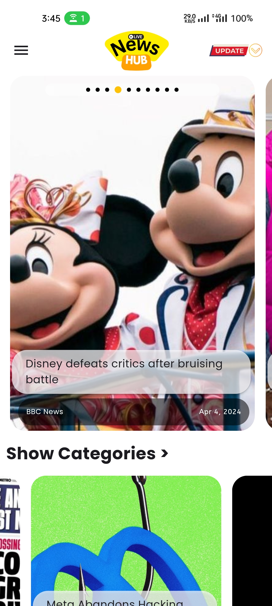
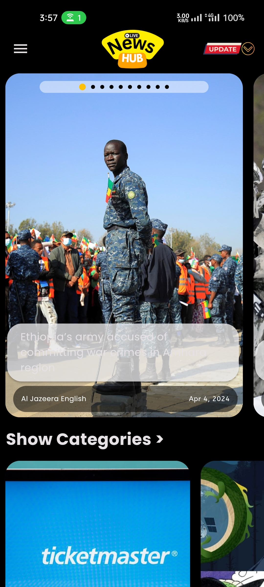
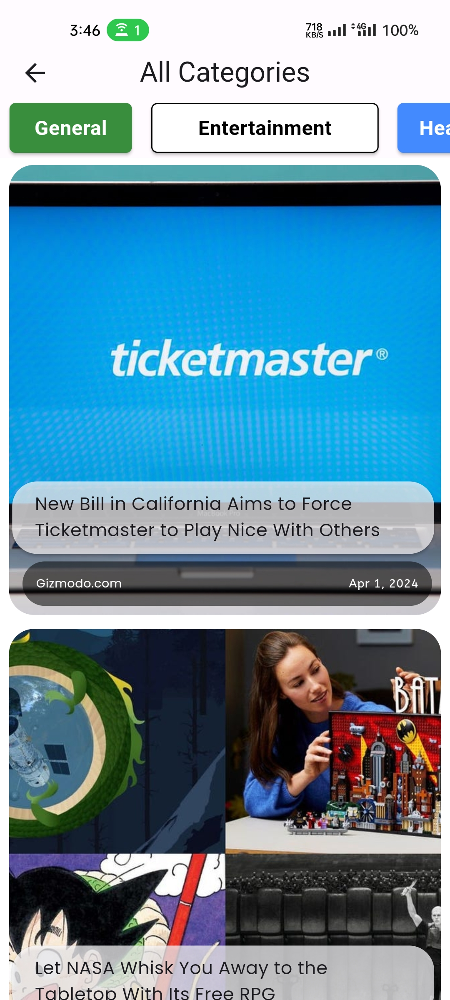
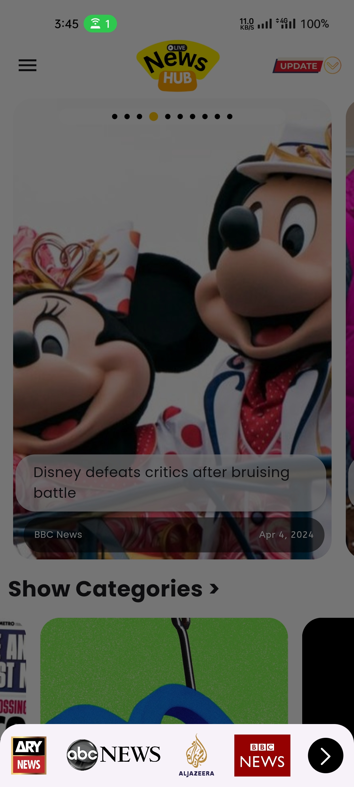

# NEWSHUB - Flutter Open Source News App
NewsHUB is a beautiful and intuitive news streaming app built with Flutter. It allows users to discover news by Category and Source.

## Features
- **Fetch News by Source:** Fetch news from top news agencies like BBC News, Al Jazeera English, etc.
- **Fetch News by Category:** Fetch news by categories like Entertainment, Sports, Tech.
- **Dark Mode Support**
- **Cache Support**
- **No Subscription Required**
- **No Ads**

## Screenshots

  
  
  
  
  

## Installation

To install NewsHUB on your Android device, simply download the APK file from the [releases page](link-to-releases) and follow the installation instructions.

# Contributing to this Repository

## Getting Started

Before you begin:
- This project is powered by Flutter. Make sure you have the latest version of Flutter installed.
- Have you read the [code of conduct](CODE_OF_CONDUCT.md)?
- Make sure to check if an [issue exists](https://github.com/ffurqanuddin/newshub_app/issues) already and see if the issue is assigned to anyone or not.
- If no one is assigned, you can start working on the issue.
- Make sure to leave a comment stating that you are working on the issue.

### Issue Already Assigned to Someone? Ask Before Starting

If the issue is already assigned to someone, leave a comment asking how you can contribute. Please do not start working on your own without confirmation.

### Ready to Make a Change? Fork the Repository

Fork using GitHub Desktop:
- [Getting started with GitHub Desktop](https://docs.github.com/en/desktop/installing-and-configuring-github-desktop/getting-started-with-github-desktop) will guide you through setting up Desktop.
- Once Desktop is set up, you can use it to [fork the repository](https://docs.github.com/en/desktop/contributing-and-collaborating-using-github-desktop/cloning-and-forking-repositories-from-github-desktop)!

Fork using the command line:
- [Fork the repository](https://docs.github.com/en/github/getting-started-with-github/fork-a-repo#fork-an-example-repository) so that you can make your changes without affecting the original project until you're ready to merge them.

Fork with [GitHub Codespaces](https://github.com/features/codespaces):
- [Fork, edit, and preview](https://docs.github.com/en/free-pro-team@latest/github/developing-online-with-codespaces/creating-a-codespace) using [GitHub Codespaces](https://github.com/features/codespaces) without having to install and run the project locally.

### Make Your Update:
Make your changes to the file(s) you'd like to update.

### Open a Pull Request
When you're done making changes and you'd like to propose them for review, open your PR (pull request). You can use the GitHub user interface for some small changes, like fixing a typo or updating a readme. You can also fork the repository and then clone it locally, to view changes and run your tests on your machine.

### Submit Your PR & Get It Reviewed
- Once you submit your PR, others from the Docs community will review it with you. The first thing you're going to want to do is a [self review](#self-review).
- After that, we may have questions, check back on your PR to keep up with the conversation.
- We may ask for changes to be made before a PR can be merged. You can make any other changes in your fork, then commit them to your branch.

### Your PR is Merged!
Congratulations! Once your PR is merged, you will be proudly listed as a contributor in the [contributor chart](https://github.com/ffurqanuddin/newshub_app/graphs/contributors).

### Self Review
You should always review your own PR first.

For content changes, make sure that you:
- [ ] Confirm that the changes don't break anything else.
- [ ] Compare your pull request's source changes to staging to confirm that the output matches the source and that everything is rendering as expected. This helps spot issues like typos, content that doesn't follow the style guide, or content that isn't rendering due to versioning problems.
- [ ] Review the content for technical accuracy.
- [ ] Copy-edit the changes for grammar or spelling mistakes.

## Feedback

We'd love to hear your feedback on NewsHUB. If you encounter any bugs, have feature requests, or just want to say hi, please [open an issue](link-to-issues) on GitHub.

## Support

For support or any inquiries, feel free to contact us at [ffurqanuddin@gmail.com](mailto:ffurqanuddin@gmail.com) or [furqanuddin@programmer.net](mailto:furqanuddin@programmer.net).
